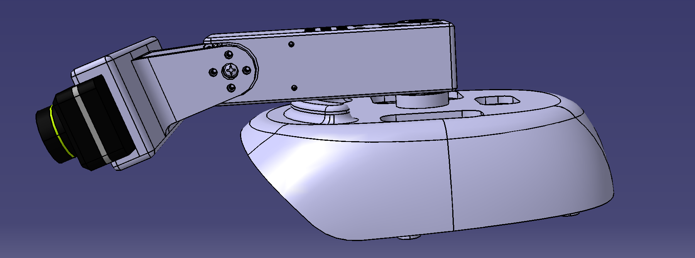

# Active Camera for Humanoid Robot Perception

Active-Camera is a library designed for humanoid robots to achieve active visual perception. It enables the head-mounted camera to have two degrees of freedom (pitch and yaw), and can be integrated with VR devices for enhanced active visual perception capabilities.

## Features

- Two degrees of freedom (2-DOF) camera movement (pitch and yaw)
- VR device integration support
- Compatible with multiple robot platforms
- Preserves original LiDAR perception capabilities
- Modular design for easy adaptation to different robots and cameras

## Todo List

- [x] Initial hardware design adaptation for G1 and ZED Mini
- [ ] Adapt for PND Adam robot
- [ ] Support for RealSense camera series
- [ ] Open source software SDK

## Hardware Requirements

### Components
The hardware consists of 6 main components, all available in the `Hardware` folder:

#### Structural Components (3D Printable)
1. Robot Base Mount - Connects to the robot body
2. Servo Mount - Holds the servo motors
3. Camera Mount - Secures the camera

All structural components can be easily 3D printed using PLA material. The design is optimized for common FDM 3D printers.

#### Active Components
1. Two Dynamixel XL330 Servo Motors - Provides the 2-DOF movement
2. ZED Mini Camera - For visual perception

### Current Implementation
- Unitree G1 Robot Series
- Dynamixel XL330 Servo Motors
- ZED Mini Camera

### Hardware Customization
The system is designed to be modular and can be adapted to work with:
- Different robot platforms (requires modification of the robot base mount)
- Various camera systems (requires modification of the camera mount)
- Different servo motor configurations (requires modification of the servo mount)

The modular design allows for easy adaptation to different hardware combinations with minimal modifications to the structural components.

## Software

The software implementation is based on the Dynamixel SDK. The source code will be open-sourced in the future. Alternatively, you can refer to the [Open Television project](https://github.com/OpenTeleVision/TeleVision) for implementation details.

## Contributing

Contributions are welcome! Please feel free to submit a Pull Request.

## Contact & Support

For any questions, suggestions, or support needs, please feel free to contact us at [hitsunzhenguo@gmail.com](mailto:hitsunzhenguo@gmail.com). We welcome any feedback that can help improve this project.

## License

This project is licensed under the MIT License - see the [LICENSE](LICENSE) file for details.

The MIT License allows for unlimited use in any application, including commercial use, modification, distribution, and private use, subject to the following conditions:

- The software and associated documentation files must include the copyright notice and permission notice
- The software is provided "as is", without warranty of any kind

For more information about the MIT License, please visit [MIT License](https://opensource.org/licenses/MIT).